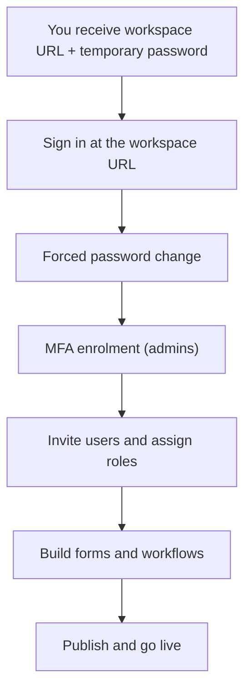

# Onboarding guide

This guide walks a brand-new organization from first sign-in to go-live. It's written for the **Administrator** who received workspace credentials.

## The onboarding flow

## 1. You receive your workspace

Before first login you should have:

- a **workspace URL** (for example `acme.netflow.app` or a login link with your organization),
- your **admin email**,
- a **temporary password** (shown once when the workspace was set up).

If anything is missing, contact whoever set up NetFlow for your company.

## 2. First sign-in and forced password change

1. Open your **workspace URL** and sign in with your email and temporary password.
2. You'll be redirected to **Set a new password** — you can't skip this. Choose a strong password (minimum 6 characters, different from the temporary one).
3. You're now signed in with a fresh session.

## 3. Enrol in MFA

As an admin you'll be prompted to set up MFA immediately. Store your backup codes safely — admins cannot disable MFA afterwards.

## 4. Invite users and assign roles

From **Users** you can add people individually or via CSV import, and assign each a role.

- If **allowed email domains** are configured, new users must use an email on one of those domains (unless outside collaborators are enabled for your workspace).
- Choose roles deliberately — only the Administrator designs forms and workflows.

See **Workspace admin** and **Roles & permissions**.

## 5. Build your first form and workflow

1. **Form** — create the form that starts the process (for example, a Leave Request).
2. **Workflow** — create the approval flow, add approval nodes, set SLAs, and **link the form**.
3. **Publish both.** A form only triggers a workflow when both are published and the form's trigger is set to run on submission.

## 6. Go live

- Share the form with your team (internal link, or a public share link for outside submitters).
- Confirm approvers can see items in **Approvals** / **My Requests**.
- Watch the first few runs under **Workflows → Executions** and the **Audit log**.

## Onboarding checklist

- [ ] Signed in and changed the temporary password
- [ ] MFA enrolled and backup codes saved
- [ ] Allowed email domains confirmed (if your company uses them)
- [ ] Users invited and roles assigned
- [ ] First form created and published
- [ ] First workflow created, linked to the form, and published
- [ ] A test submission completed end to end
