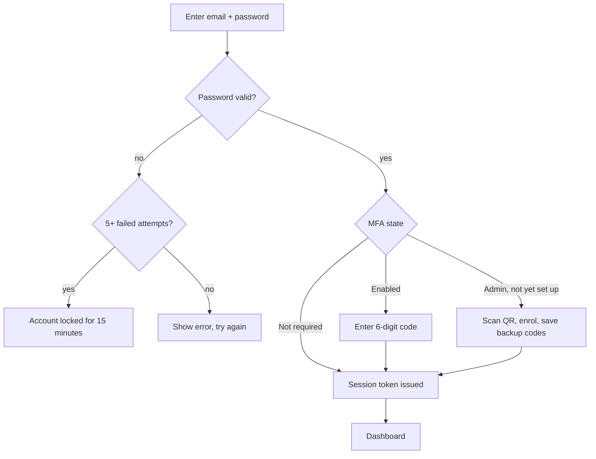
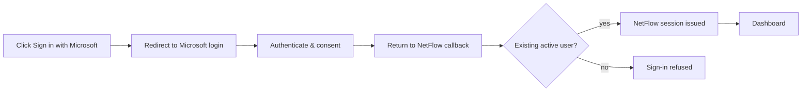
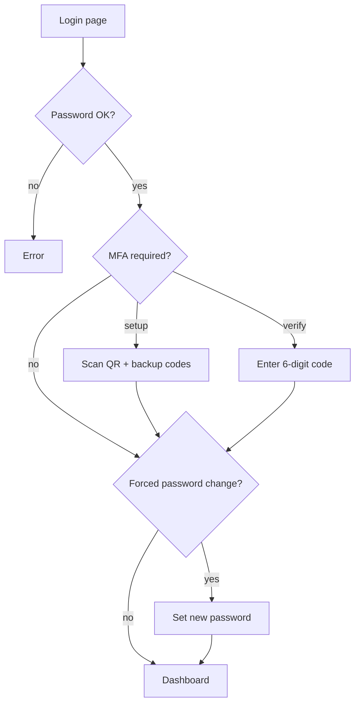

# Account & sign-in

How to get into NetFlow: password login, workspaces, MFA, Microsoft SSO, and password recovery.

## Sign in with email and password

**Goal:** Open your workspace dashboard.

1. Open your NetFlow URL (workspace subdomain if your org uses one, e.g. `acme.netflow.app`).
2. Confirm the **workspace name** shown above the form (if your org uses workspaces).

   

3. Enter your **email** and **password**.
4. Click **Sign in**.

   

**You should see:** the [Dashboard](/guide/dashboard), or an MFA / password-change screen if required.

::: warning Wrong password
After **5 failed attempts** the account locks for **15 minutes**. Wait, or use [Forgot password](#forgot-password).
:::

### How login chooses your account

- The same email can exist in more than one organization.
- The **workspace** decides which account you authenticate against.
- If the workspace is **suspended**, sign-in is blocked and the page tells you so.

## Set up MFA (admins — first login)

**Goal:** Enrol an authenticator app so you can finish signing in.

1. Sign in with email and password. NetFlow shows a **setup** screen with a QR code.
2. Open Google Authenticator, Authy, or Microsoft Authenticator.
3. Scan the QR code (or type the manual key).
4. Enter the current **6-digit code** to confirm.
5. **Copy and store** the **8 backup codes** shown once.

::: warning Save backup codes
They appear **only once**. Each code works a single time if you lose your phone. Admins **cannot** turn MFA off later.
:::

**You should see:** your session starts and you land on the dashboard.

## Verify MFA at sign-in

**Goal:** Complete login when MFA is already enabled.

1. Enter email and password, then click **Sign in**.
2. Enter the **6-digit code** from your authenticator.
3. If you cannot open the app, enter one **backup code** instead (it is then used up).

**You should see:** the dashboard.

::: tip Non-admin MFA
Non-admin users may turn MFA on or off later (with a valid code). Admins must keep MFA on.
:::

## Sign in with Microsoft (SSO)

**Goal:** Use Microsoft instead of a NetFlow password (if your org enabled SSO).

1. On the login page, click **Sign in with Microsoft**.
2. Complete Microsoft login and consent.
3. Wait to return to NetFlow.

**You should see:** the dashboard if an **active** NetFlow user already exists for that Microsoft email. SSO does **not** create accounts — an admin must add you first.

## Forgot password

**Goal:** Get a reset link by email.

1. On the login page, click **Forgot password**.
2. Enter your email and submit.

   

3. Check your inbox. The page always shows a generic “if an account exists…” message (it never reveals whether the email is registered).

**You should see:** an email with a reset link valid for **30 minutes** (if the account exists).

## Reset password

**Goal:** Set a new password from the email link.

1. Open the link from the email (expired links are rejected before you type).
2. Enter a new password (minimum 6 characters).

   

3. Submit.

**You should see:** confirmation, then the login page. **All existing sessions are revoked.**

## Profile

**Goal:** Review your account and sign-in security.

1. Open **Profile** from the user menu (Administrators also have **Profile** under Settings).

   

2. Everyone sees identity (name, email, role) and can manage **two-factor authentication** and **Change password**.
3. **Administrators** also see a **workspace** summary (plan, licence, billing contact), **plan & usage** meters, and shortcuts into Users / Departments / Roles / Organization / Forms / Workflows. Approval-loop prefs (notifications, out-of-office, reporting line) are hidden — admins configure the workspace rather than living in Approvals.
4. **Leader / Employee** profiles keep notification channel toggles, out-of-office + delegate, and manager / HR / reports when they apply.

## Change password (from Profile)

**Goal:** Update your password while signed in.

1. Open **Profile** (user menu).
2. Choose **Change password** (or follow the forced **Set a new password** screen).

   

3. For a voluntary change: enter **current** password and a **new** one (must be different).
4. For a **forced** change (temp password from an admin): enter only the new password — you cannot use the rest of the app until this is done.

**You should see:** success; other sessions are revoked. Forced-change users then continue into the app.

::: tip New org admins
New Administrators often start with a temporary password and this forced step before they can use the rest of the app.
:::

## Sign out

1. Open the user menu.
2. Click **Sign out**.

**You should see:** the login page. Your session is revoked immediately.

