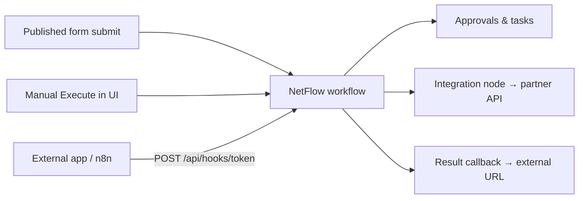
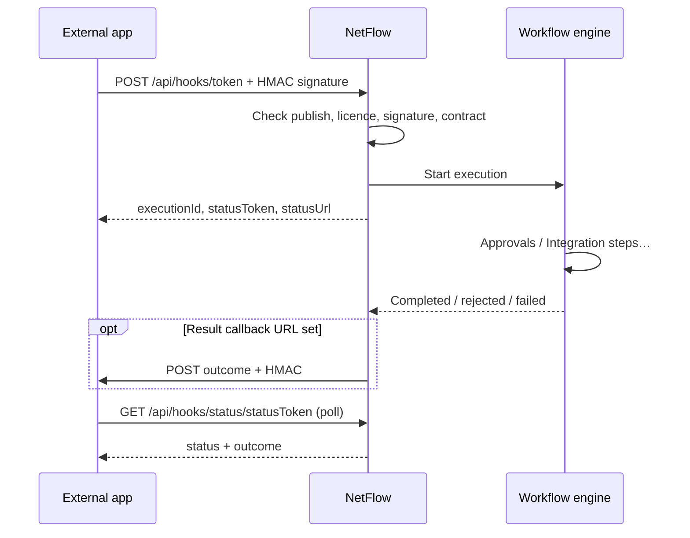
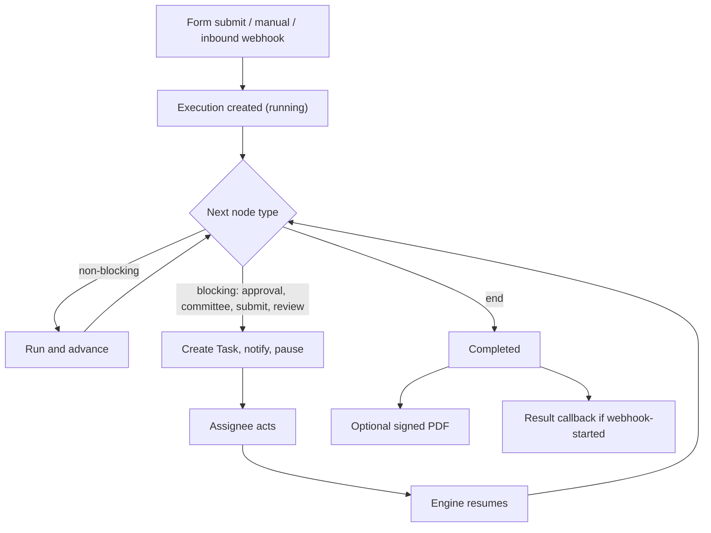

# Workflows

A workflow is a visual graph that runs when a form is submitted, when you trigger it manually, or when an **inbound webhook** starts a run from an external system. It decides who acts, in what order, with SLAs.

::: tip Who can build workflows
Only the **Administrator** (`Admin`) designs and publishes workflows (and needs a free builder seat on the plan). Leaders and employees submit through published forms or act on tasks — they do not edit the builder.
:::

## Workflow status

| Status | Meaning |
| --- | --- |
| **Draft** | Editable; does not run |
| **Published** | Live; can run on form submit, manual execute, or inbound webhook |
| **Paused** | Temporarily not running |

Publishing checks that the graph has a **start** and an **end** node. A published flow also needs a **linked form** and/or an **enabled inbound webhook** before it can start runs.

## How triggers connect



## Step 1 — Open Workflows

1. In the sidebar, click **Workflows**.

   

2. Review existing flows, or create a new one.

## Step 2 — Start the builder wizard

1. Click **New**.

   

2. Pick a **template** (Leave Approval, Expense Reimbursement, IT Access, Purchase Order, Onboarding) or start from scratch.

**You should see:** the next wizard step (canvas).

## Step 3 — Design the canvas

1. Open the **Canvas** step.

   

2. **Add nodes** — drag from the left palette, or click a type to place it.
3. **Connect** — drag from a node’s bottom handle to another node’s top handle.
4. **Configure** — select a node; use the right panel for approver, SLA, instructions, etc.
5. **Pan / zoom** — drag empty space; scroll to zoom; use **Fit** to frame the graph.
6. Delete a connection by clicking it; delete a node with its ×.

### Node cheat sheet

| Node | What it does |
| --- | --- |
| **Start** | Entry |
| **Approval** | One person decides (optional e-signature, sequential chain) |
| **Multi-Approval** | Committee, N-of-M votes |
| **Submit** | Assignee fills an inline form |
| **Review** | Forward or send back for changes |
| **Condition** | Branch on last approved/rejected outcome |
| **Notify** | Notification step (in-app in current build) |
| **Integration** | Outbound HTTPS call to an external API mid-flow (retries + dead-letter on failure) |
| **Timer** | Wait step (advances immediately in current build) |
| **End** | Finish; optional signed PDF / result callback for webhook-started runs |

::: info Approver tokens
You can assign `direct_manager`, `hr_partner`, `ceo`, `<department>_manager`, or a specific person. How those resolve is under Approver resolution below.
:::

**You should see:** a connected path from Start → … → End with no orphan nodes.

## Step 4 — Settings & triggers

1. Open **Settings & triggers**.

   

2. Set **name**, description, category.
3. **Link a published form** (optional if you only use an inbound webhook).
4. Choose trigger: **automatic on form submit** and/or allow **manual** execute.
5. Set who can submit / who can see, and SLA-breach notification preferences.
6. Optionally enable **Inbound webhook** (next section).

**You should see:** a form linked and/or inbound webhook enabled, and a trigger mode chosen.

## Inbound webhook (external start)

Use this when an external form, n8n, or partner app should **start** a NetFlow run without a signed-in user.

### Configure in the builder

1. In **Settings & triggers**, turn on **Enable inbound webhook**.
2. Save the workflow so NetFlow issues a **Webhook URL** and **Signing secret**.
3. Copy both. Keep the secret private (Reveal / Copy on the same screen).
4. Optionally set a **Result callback URL** — when the run finishes, NetFlow POSTs the outcome there.
5. Optionally add a **payload contract** (field names that must be present). Missing keys → request rejected.
6. **Publish** the workflow. Draft or paused flows reject webhook traffic.

### Inbound flow (what happens)



### What the external caller sends

**HTTP**

- Method: `POST`
- Path: `/api/hooks/<token>` (token from the Webhook URL)
- Header: `Content-Type: application/json`
- Header: `X-NetFlow-Signature: sha256=<hex>` — HMAC-SHA256 of the **raw JSON body** using the signing secret
- Header (recommended): `Idempotency-Key: <opaque string>` — same key retries return the same execution (kept ~7 days)
- Rate limit: **60 requests / minute / IP**

**Body (either shape)**

Flat fields become form data:

```json
{
  "employeeName": "Asha",
  "days": 3,
  "reason": "Family travel"
}
```

Or wrapped:

```json
{
  "formData": {
    "employeeName": "Asha",
    "days": 3
  },
  "submitter": {
    "name": "Asha Kumar",
    "email": "asha@example.com"
  }
}
```

**Success response (conceptually)** includes:

- `executionId` — the run id inside NetFlow  
- `statusToken` / `statusUrl` — public poll URL for approve/reject outcome  

**Result callback body (when configured)** — NetFlow POSTs something like `{ status, outcome, formData, submitter, statusUrl }`, signed with the same secret.

### Inbound vs outbound (Integration node)

| Direction | Feature | When |
| --- | --- | --- |
| **Outside → NetFlow** | Inbound webhook | Start a run from an external system |
| **NetFlow → outside** | Integration node on the canvas | Call a partner API mid-flow |
| **NetFlow → outside** | Result callback URL | Tell the external app the final approve/reject |

Failed Integration calls appear in that workflow’s **integration dead-letter** list. Inbound attempts appear in the **webhook delivery log**.

## Step 5 — Review and publish

1. Open **Review & publish**.

   

2. Clear the checklist: form linked *or* webhook on, every approval has an owner, SLAs set, branches wired.
3. Click **Publish**.

**You should see:** status **Published**. Matching form submits or webhook POSTs can start executions.

## Step 6 — Run and monitor

1. Submit the linked form (automatic), use **Execute** on the workflow (manual), **or** POST to the inbound webhook.
2. Open **Executions** on that workflow.

   

3. Drill into a run: status, step log, variables.
4. If allowed, the submitter can **cancel** an in-flight run from their request.

**You should see:** blocking steps create tasks in **Approvals / My Requests** for assignees.

## How an execution runs



### Approver resolution

When a step says “send to manager” (or similar), NetFlow picks a person in this order:

1. Semantic tokens such as `direct_manager`, `hr_partner`, `ceo`, `<department>_manager`.
2. A plain role name in the submitter’s department when possible.
3. If the assignee is out of office, the configured **delegate** on their profile.

### SLAs

Blocking nodes set a due date. An hourly job escalates overdue tasks and can notify admins per workflow policy.
