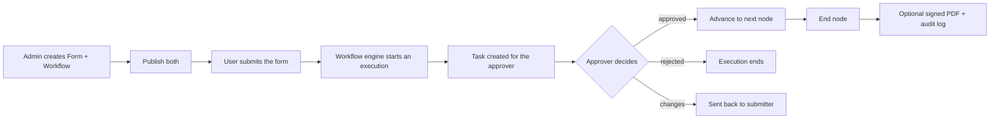

# Introduction

NetFlow is a no-code platform for building **forms**, automating **approval workflows**, and managing day-to-day requests in your organization. Teams design a form, connect it to a workflow, and NetFlow routes every submission to the right approvers, tracks SLAs, and keeps a clear audit trail.

## What you can do

- **Collect structured data** with a drag-and-drop form builder (field types, validation, conditional logic, file uploads, and public share links).
- **Automate approvals** on a visual canvas with approval, committee, submit, review, condition, integration, and timer nodes.
- **Act on work** from a single task inbox: approve, reject, request changes, submit, or review, with optional e-signatures.
- **Start runs from outside** with inbound webhooks, and call partner systems mid-flow with Integration nodes.

## Core concepts

- **Form** — a set of fields users fill in. Forms have a lifecycle: `draft` → `published` → `archived`. Only published forms can be filled or shared.
- **Workflow** — a graph of nodes that runs when a form is submitted, triggered manually, or started by an inbound webhook.
- **Execution** — one running instance of a workflow, created per submission. It tracks the current node, variables, and a step-by-step log.
- **Task** — a unit of work assigned to a person by the workflow (an approval, a form to submit, or a document to review).
- **Organization / workspace** — your company’s NetFlow space (URL, users, forms, and workflows).
- **Role** — determines what a user can see and do. Only the **Administrator** designs forms and workflows.

## How it fits together

A submission creates an **execution**. The engine walks the workflow node by node: non-blocking nodes (condition, notify, integration, timer) advance automatically, while blocking nodes (approval, committee, submit, review) create a **task** and pause until someone acts.

## Where to go next

- New to NetFlow? Start with the **Quick start**.
- Setting up a brand-new workspace? Follow the **Onboarding guide**.
- Ready to build? Jump to **Forms**, then **Workflows**.

::: tip Roles matter
Forms and workflows are designed only by the **Administrator** (with a builder seat). Leaders approve and report; employees submit and track. See **Roles & permissions**.
:::
