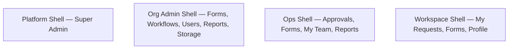

# Roles & permissions

What each role can do in your NetFlow workspace.

## Roles at a glance

| Role | What they do |
| --- | --- |
| **Administrator** (`Admin`) | Designs forms and workflows, manages users, departments, roles view, and organization settings |
| **CEO**, **VP**, **Manager**, **HR** | Approve work, view team and reports (within their reporting line) |
| **Employee** | Submit requests and track their own work |

## Capability matrix

| Capability | Who |
| --- | --- |
| **Design** forms and workflows | Administrator (needs a free builder seat) |
| **Manage users** | Administrator |
| **Approve** tasks | Administrator, CEO, Manager, HR, VP |
| **Submit** forms | All of the above **plus** Employee |
| **Reports** (analytics / audit) | Administrator, CEO, Manager, HR, VP |
| **My team** | Administrator, CEO, Manager, HR, VP |

## The 4 App Shells (What each person sees)

NetFlow uses four distinct App Shells to serve different personas based on their role and organization features:

| Shell | Who uses it | Key navigation |
| --- | --- | --- |
| **Platform** | Super Admin | Organizations, Usage, Activity, Health, Plans, Admins |
| **Org Admin** | Administrator | Management, DMS, Monitoring, Settings |
| **Ops** | CEO, VP, Manager, HR | Approvals, Forms, My Team, Reports |
| **Workspace** | Employee | Dashboard, My Requests, Forms, Profile |

**Note on Feature Flags:** Some navigation items (like **DMS** or **S3 Storage** under Org Admin) only appear if the corresponding feature flags (`dmsEnabled`, `s3Enabled`) are toggled on for your workspace by a Super Admin.

## Authority follows the reporting line

Being a Manager does not mean the whole company — it means **your people**:

| Role | Reach |
| --- | --- |
| Administrator, CEO | Whole workspace |
| Manager, HR, VP | Everyone below them on the manager chain (and people who name them as HR partner) |
| Everyone else | Themselves |

Team inbox, acting on someone else’s request, and analytics all use that reach so leaders only see their team.

## Departments

Each workspace owns its own department list. Renaming moves people and workflows with it; deleting is blocked while anyone is still in that department.

## Organization settings

Administrators can edit the **display name** and **billing contact**. Plan, licence dates, sign-in domains, and feature flags are shown read-only — change those through whoever manages your NetFlow subscription.
