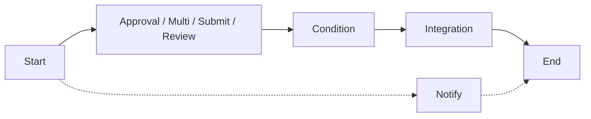
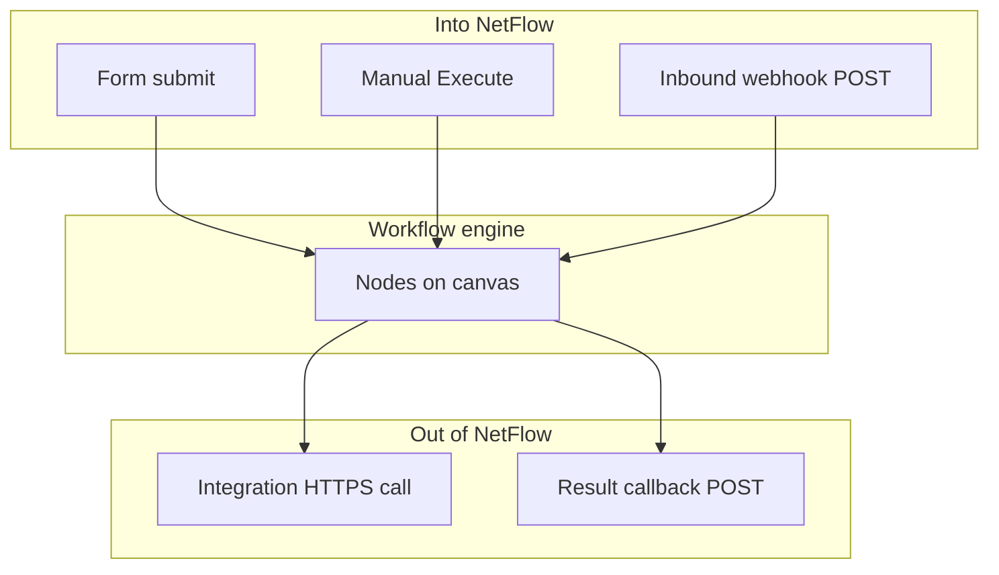

# Workflow nodes

Cheat sheet of the canvas palette, plus how runs get started and call outside systems.

## Canvas nodes

| Node | Blocking? | Purpose |
| --- | --- | --- |
| **Start** | No | Entry point of the flow |
| **Approval** | Yes | A single approver approves / rejects / requests changes |
| **Multi-Approval** | Yes | Committee vote with an N-of-M quorum |
| **Submit** | Yes | Assignee fills an inline form to advance |
| **Review** | Yes | Reviewer forwards or sends back for changes |
| **Condition** | No | Branches on the last approval outcome |
| **Notify** | No | Sends a notification (in-app today) |
| **Integration** | No | Outbound HTTPS call mid-flow (method, headers, auth, body). Failures can retry and land in the workflow **integration dead-letter** list |
| **Timer** | No | Waits a duration (advances immediately today) |
| **End** | No | Finishes the run; optional signed PDF. Webhook-started runs may also fire a **result callback** |

**Blocking** nodes create a task and pause the execution until someone acts. **Non-blocking** nodes run and advance automatically.

## Triggers and callbacks (Settings, not nodes)

Configured on **Settings & triggers**, not dragged onto the canvas:

| Name | Direction | What it does |
| --- | --- | --- |
| **Form submit** | In | Linked published form creates a run |
| **Manual execute** | In | Allowed user starts a run from the UI |
| **Inbound webhook** | In | External `POST /api/hooks/<token>` starts a run (HMAC + optional field contract) |
| **Result callback** | Out | On finish of a webhook-started run, NetFlow POSTs outcome to your URL |
| **Integration node** | Out | Mid-flow HTTP to a partner API |

::: tip Approver tokens
Approval / submit / review nodes can target `direct_manager`, `hr_partner`, `ceo`, or `<department>_manager`. NetFlow resolves those per submitter (org chart + out-of-office delegate).
:::
