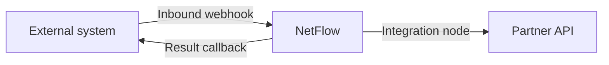
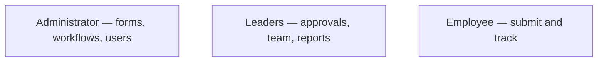

# Release notes

Notable changes in the current NetFlow build.

## Unreleased

### Integrations

- **Inbound webhooks** — start a published workflow from an external system (signed requests, optional field contract, rate limits).
- **Result callback + status polling** — external forms receive approve/reject outcomes via callback URL or status URL.
- **Outbound Integration node** — mid-flow HTTPS calls; failed calls surface in the workflow dead-letter list.
- **Webhook delivery log** for inbound attempts.

### New Features & Dashboards

- **DMS dashboard UI** — a full file browser for managing internal workspace documents.
- **S3 storage UI** — external AWS S3 bucket integration and file browser.
- **Plan & Usage page** — dedicated billing dashboard for quota tracking and limits.
- **AI assistant** — global floating chat widget and AI-powered form/workflow builder.
- **Product tour** — role-based guided walkthrough for new users.
- **Org Admin nav restructure** — streamlined sidebar with MANAGEMENT, DMS, MONITORING, and SETTINGS sections.

### Plans & usage

- Plans: Trial, Basic, Professional, Enterprise.
- Negotiated limits keep the **selected plan name** (for example Enterprise with tightened seats still shows **Enterprise**).
- Usage meters in the Administrator profile and Users area; read-only mode when a licence has ended.

### Roles & profile

- Administrator Profile: identity, MFA, workspace summary, plan & usage, admin shortcuts.
- Leader / Employee Profile: notifications, out-of-office, reporting line where relevant.

### Sign-in

- Microsoft SSO, MFA for admins, forced password change when a temporary password was issued.

### Documentation

- Product docs use step text, screenshots, and flowcharts (workflows, admin, roles).
