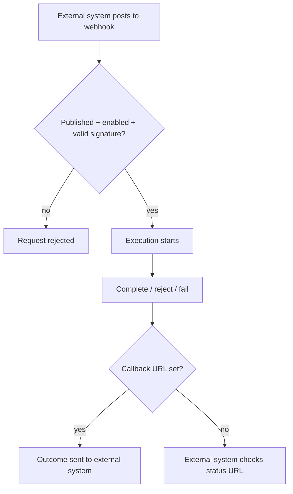

# Troubleshooting

Fixes for the most common issues people hit while using NetFlow.

## Sign-in & workspaces

### "Unknown workspace"

The app couldn't find your organization from the address.

- Open the **workspace URL** you were given (not a generic hosting page).
- Confirm the organization name matches what your administrator shared.

### Organization suspended

Sign-in is blocked because the organization is suspended. Contact whoever manages your NetFlow subscription to have it reactivated.

### Self-registration disabled

If you cannot sign up for an account, it may be because your organization has disabled self-registration. In this case, an Administrator must manually create your account and invite you.

## Licensing & Limits

### Workspace in Read-only mode

If your workspace displays a read-only banner, your license has expired or your subscription was suspended. Users can log in and view historical data, but no new requests or workflows can be started. Contact billing or your account manager.

### Plan limit exceeded

If you hit a limit on your plan (e.g., users, active forms, or storage):
- **Users**: You cannot invite new people.
- **Storage**: New file uploads and DMS operations will fail.
You must clean up unused resources or upgrade your subscription plan via **Plan & Usage**.

### Builder seat full

If an Administrator cannot access the workflow or form builders, the workspace has reached its limit for active builder seats. An existing builder must be demoted, or your plan must be upgraded.

## Multi-factor authentication

- **Lost authenticator** — use one of the backup codes shown during setup (each works once).
- **Admins can't disable MFA** — this is by design; the role requires it.
- **Code rejected** — ensure your device clock is accurate; a small drift is tolerated but large offsets fail.

## Microsoft sign-in

- **"Sign-in refused" for a valid Microsoft account** — SSO only works for people who already exist in NetFlow. Ask an Administrator to add your email first, then try again.
- **Redirect / app configuration errors** — those are set up when NetFlow is installed for your company. Contact your Administrator or NetFlow support; you cannot fix them from the product UI.

## Advanced Features & Integrations

- **DMS not connected / login failed** — ensure your user account has the proper permissions and the DMS service is reachable. Check if the `dmsEnabled` flag is active for your org.
- **S3 connection errors** — this means the external AWS S3 bucket credentials or policies configured in the Platform are incorrect or expired.
- **AI assistant not visible** — the floating AI widget and form builder will not appear if the LLM provider has not been configured by the Platform Super Admin.

## Forms & workflows

- **Can't create or edit forms/workflows** — only the **Administrator** (with a free builder seat) can design.
- **Submitting a form didn't start an approval** — both the form and a linked workflow must be **published**, and the form's trigger must be set to run on submission. Public share-link submissions do not start workflows.
- **External form / inbound webhook didn't start a run** — In **Settings & triggers**, enable **Inbound webhook**, **publish** the workflow, then have the external system POST to the webhook URL with a valid signature.
- **Webhook signature rejected** — the external system must sign the exact JSON body with the workflow **signing secret** (header `X-NetFlow-Signature`).
- **Webhook started twice** — the external system should send a stable **Idempotency-Key** on retries.
- **Rate limited on webhooks** — too many requests from one address; slow down and retry later.
- **Integration call failed but workflow continued** — by default Integration continues on error. Open the task → **External calls** for status/attempts, or turn off “Continue workflow if the call fails” on the Integration node. Failed calls also appear under Workflow settings → **Integration dead letters**.
- **External form needs approve/reject result** — set a **Result callback URL** on the inbound webhook, or use the status URL returned when the run started.
- **Webhook rejected for missing fields** — the payload is missing a required field from the workflow’s payload contract; align field names or clear the contract.
- **Public form submission fails** — public forms limit how often one address can submit and how large uploads can be. Wait and retry, or reduce file size.

## Still stuck?

Ask your workspace **Administrator**, or contact NetFlow support with the exact error message and what you were doing when it appeared.
